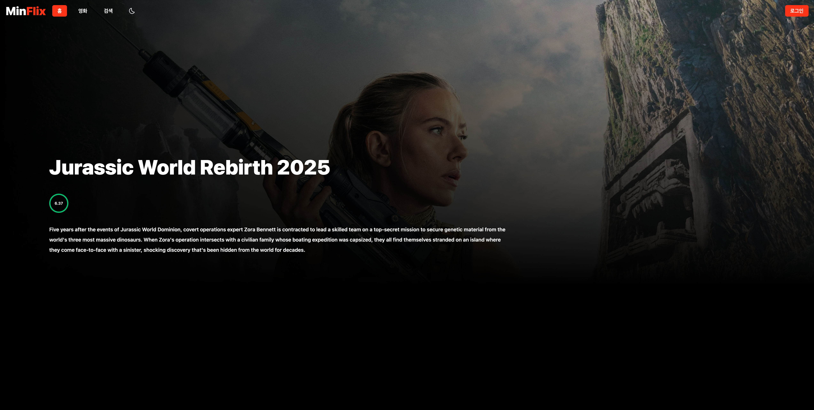

# 🎬 MinFlix - 영화 추천 서비스 웹



> 넷플릭스 스타일의 영화 추천 및 정보 제공 웹 서비스

## 📋 프로젝트 개요

MinFlix는 TMDB API를 활용하여 최신 영화 정보를 제공하고, 사용자가 영화를 검색하고 즐겨찾기에 추가할 수 있는 영화 추천 웹 서비스입니다. 넷플릭스와 유사한 UI/UX를 제공하며, 카카오 소셜 로그인과 이메일 회원가입을 지원합니다.

## 🌐 배포 정보

- **배포 URL**: https://minak-movieweb.netlify.app
- **Test ID**: test@test.com
- **Test PW**: 123123

## 📅 개발 기간

**2024-08-20 ~ 2024-08-27** (8일)

## ✨ 주요 기능

### 🎥 영화 정보

- **메인 페이지**: 현재 상영중, 인기순, 랭킹 TOP 20, 개봉 예정 영화 제공
- **영화 상세**: 상세 정보, 예고편, 추천 영화, 사용자 리뷰
- **검색 기능**: 영화, TV 프로그램, 배우 통합 검색 (실시간 검색)

### 👤 사용자 관리

- **다중 로그인**: 이메일/비밀번호, 카카오 OAuth 로그인
- **회원가입**: 이메일 기반 회원가입 및 유효성 검사
- **마이페이지**: 사용자 프로필 관리

### ❤️ 개인화 기능

- **즐겨찾기**: 관심 있는 영화 저장 및 관리
- **리뷰 시스템**: 영화별 댓글 작성 및 조회

### 🎨 UI/UX

- **반응형 디자인**: 모든 디바이스 지원
- **스와이퍼 캐러셀**: 영화 목록 슬라이더
- **다크 모드**: 시각적 편의성 제공
- **토스트 알림**: 사용자 피드백

## 🛠 기술 스택

### Frontend

- **React** 18.3.1 - UI 라이브러리
- **Redux Toolkit** - 상태 관리
- **React Router DOM** - 클라이언트 사이드 라우팅
- **Styled Components** + **SCSS** - 스타일링
- **Tailwind CSS** - 유틸리티 스타일링
- **Swiper** - 터치 슬라이더
- **React Toastify** - 알림 컴포넌트

### Build Tools & Development

- **Vite** - 빌드 도구 및 개발 서버
- **ESLint** - 코드 품질 관리

### HTTP Client

- **Axios** - API 통신

### Backend Services

- **Supabase** - 백엔드 서비스 (인증, 데이터베이스)
- **TMDB API** - 영화 데이터
- **Kakao OAuth API** - 소셜 로그인

## 📁 프로젝트 구조

```
movie-web/
├── public/                     # 정적 파일
│   ├── movieDetailData.json   # 영화 상세 데이터
│   ├── movieListData.json     # 영화 목록 데이터
│   └── thumbnail.png          # 프로젝트 썸네일
├── src/
│   ├── api/                   # API 관련 파일
│   ├── assets/                # 이미지, 아이콘 등
│   ├── client/                # HTTP 클라이언트 설정
│   │   ├── client.js         # Supabase 클라이언트
│   │   └── clientMovie.js    # TMDB API 클라이언트
│   ├── components/            # 재사용 가능한 컴포넌트
│   │   ├── auth/             # 인증 관련 컴포넌트
│   │   ├── Swiper/           # 슬라이더 컴포넌트
│   │   ├── Card/             # 영화 카드
│   │   ├── Header/           # 헤더
│   │   └── ...
│   ├── layouts/              # 레이아웃 컴포넌트
│   ├── pages/                # 페이지 컴포넌트
│   │   ├── Home/            # 메인 페이지
│   │   ├── Search/          # 검색 페이지
│   │   ├── Detail/          # 영화 상세 페이지
│   │   ├── Favorite/        # 즐겨찾기 페이지
│   │   └── Mypage/          # 마이페이지
│   └── store/               # Redux 상태 관리
│       ├── store.jsx        # 스토어 설정
│       ├── movieSlice.jsx   # 영화 상태
│       ├── userSlice.jsx    # 사용자 상태
│       └── thunk.jsx        # 비동기 액션
├── package.json
└── vite.config.js
```

## 🚀 설치 및 실행

### 1. 저장소 클론

```bash
git clone https://github.com/your-username/movie-web.git
cd movie-web
```

### 2. 의존성 설치

```bash
npm install
```

### 3. 환경 변수 설정

`.env` 파일을 생성하고 다음 환경 변수를 설정하세요:

```env
# TMDB API
VITE_MOVIE_URL=https://api.themoviedb.org/3
VITE_MOVIE_ACCESS_TOKEN=your_tmdb_access_token
VITE_MOVIE_APIKEY=your_tmdb_api_key
VITE_IMG_URL_ORIGINAL=https://image.tmdb.org/t/p/original

# Supabase
VITE_SUPABASE_URL=your_supabase_url
VITE_SUPABASE_APIKEY=your_supabase_api_key

# Kakao OAuth
VITE_KAKAO_REST_API_KEY=your_kakao_rest_api_key
VITE_KAKAO_REDIRECT_URI=your_kakao_redirect_uri
```

### 4. 개발 서버 실행

```bash
npm run dev
```

### 5. 빌드

```bash
npm run build
```

## 📱 주요 페이지

| 페이지        | 경로                   | 설명                          |
| ------------- | ---------------------- | ----------------------------- |
| 홈            | `/`                    | 영화 카테고리별 슬라이더 제공 |
| 검색          | `/search`              | 영화/TV/배우 통합 검색        |
| 상세          | `/detail/:id`          | 영화 상세 정보 및 리뷰        |
| 목록          | `/detail`              | 영화 목록 페이지              |
| 즐겨찾기      | `/favorite`            | 사용자가 저장한 영화 목록     |
| 마이페이지    | `/mypage`              | 사용자 프로필 관리            |
| 카카오 로그인 | `/auth/kakao/callback` | 카카오 OAuth 콜백             |

## 🔌 API 정보

### TMDB API 엔드포인트

- `GET /movie/now_playing` - 현재 상영중 영화
- `GET /movie/popular` - 인기 영화
- `GET /movie/top_rated` - 높은 평점 영화
- `GET /movie/upcoming` - 개봉 예정 영화
- `GET /movie/{id}` - 영화 상세 정보
- `GET /movie/{id}/videos` - 영화 예고편
- `GET /movie/{id}/similar` - 유사한 영화
- `GET /search/movie` - 영화 검색
- `GET /search/tv` - TV 프로그램 검색
- `GET /search/person` - 배우 검색

### Supabase API

- `POST /auth/v1/token` - 사용자 로그인
- `GET /auth/v1/user` - 사용자 정보
- `GET /rest/v1/profiles` - 사용자 프로필
- `GET /rest/v1/comments` - 영화 댓글
- `POST /rest/v1/comments` - 댓글 작성
- `GET /rest/v1/favorites` - 즐겨찾기 목록

## 🏗 주요 기능 구현

### 상태 관리 (Redux)

- **movieMain**: 메인 페이지 영화 데이터
- **user**: 사용자 정보 및 인증 상태
- **favorites**: 즐겨찾기 목록
- **modal**: 모달 상태 관리
- **globalLoading**: 전역 로딩 상태

### 인증 시스템

- JWT 토큰 기반 인증
- 로컬 스토리지에 토큰 저장
- 카카오 OAuth 2.0 연동
- 자동 로그인 유지

### 성능 최적화

- React.memo를 활용한 컴포넌트 최적화
- 이미지 지연 로딩
- API 요청 디바운싱 (검색)
- Promise.all을 활용한 병렬 API 호출

## 📝 스크립트 명령어

```bash
npm run dev      # 개발 서버 실행
npm run build    # 프로덕션 빌드
npm run lint     # ESLint 검사
npm run preview  # 빌드된 앱 미리보기
```

## 🤝 기여하기

1. Fork the Project
2. Create your Feature Branch (`git checkout -b feature/AmazingFeature`)
3. Commit your Changes (`git commit -m 'Add some AmazingFeature'`)
4. Push to the Branch (`git push origin feature/AmazingFeature`)
5. Open a Pull Request

## 📄 라이선스

이 프로젝트는 MIT 라이선스 하에 있습니다.

---

**MinFlix**로 최신 영화 정보를 확인하고 나만의 영화 리스트를 만들어보세요! 🍿
